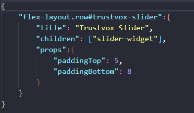

📢 Use this project, [contribute](https://github.com/{OrganizationName}/{AppName}) to it or open issues to help evolve it using [Store Discussion](https://github.com/vtex-apps/store-discussion).

# Trustvox Widgets

<!-- DOCS-IGNORE:start -->
<!-- ALL-CONTRIBUTORS-BADGE:START - Do not remove or modify this section -->

<!-- ALL-CONTRIBUTORS-BADGE:END -->
<!-- DOCS-IGNORE:end -->

An unofficial app to display the Trustvox opinions into your VTEX IO store. 

Remember that this apps depends of Trustvox Pixel app.

Developed by Helen Furtner to [Gerador de Ideias](https://www.geradordeideias.com)

## Configuration 

1. Before start to displaying the opinions into your store, you must to install the [Trustvox Pixel App](https://github.com/helenfurtner/trustPixel) 

2. Add into your manifest.json the Trustvox Widget app as a depedency

3. Insert the blocks into your store block:

- "slider-widget" to display opinion carousel block

Example:

    

